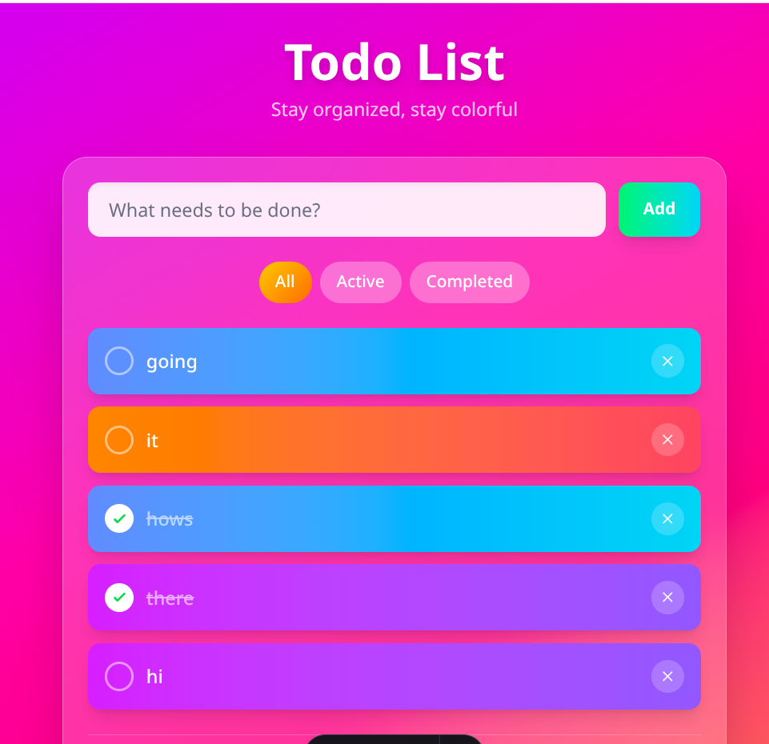

# Todo App

A colorful, fully static todo app built with Astro and Tailwind CSS.

## Features

- Add, complete, and delete todos
- Filter by All / Active / Completed
- Colorful gradient backgrounds for each todo
- LocalStorage persistence
- Smooth animations
- Fully static - works on GitHub Pages

## Commands

| Command       | Action                                      |
| :------------ | :------------------------------------------ |
| `bun install` | Install dependencies                        |
| `bun dev`     | Start local dev server at `localhost:4321`  |
| `bun build`   | Build production site to `./dist/`          |
| `bun preview` | Preview build locally before deploying      |

## Deploy

Push to GitHub and enable GitHub Pages with "GitHub Actions" as the source. The included workflow handles the rest.
